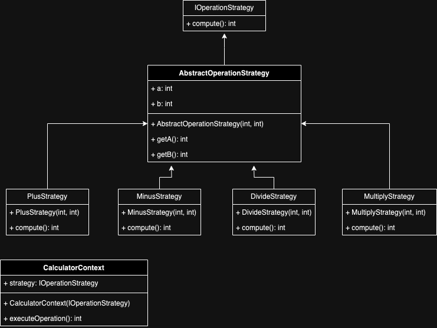
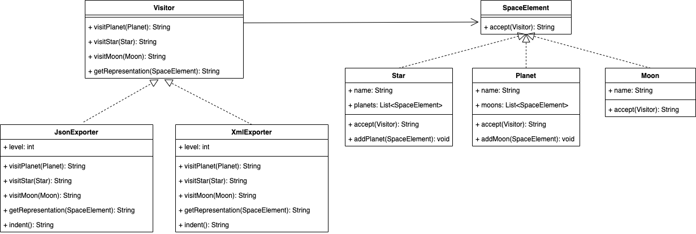

# Design Pattern
## [Behavioral](src/main/java/behavioral)
### [Chain of Responsability](src/main/java/behavioral/chainResponsability)

### [Command](src/main/java/behavioral/command)
- When you need parameterize objects according to an action perform.
- When you need to create and execute requests at different times.
- When you need to support rollback, logging or transaction functionality.

### [Mediator](src/main/java/behavioral/mediator)
Mediator pattern is used to reduce communication complexity between multiple objects or classes. This pattern provides a mediator class which normally handles all the communications between different classes and supports easy maintenance of the code by loose coupling. Mediator pattern falls under behavioral pattern category.

### [Memento](src/main/java/behavioral/memento)
Typically, the Memento Design Pattern will be used in situations where some actions are undoable, therefore requiring to rollback to a previous state. However, if the state of the Originator is heavy, using the Memento Design Pattern can lead to an expensive creation process and increased use of memory.

### [Observer](src/main/java/behavioral/observer)
Lets you define a subscription mechanism to notify multiple objects about any events that happen to the object they’re observing.

### [Strategy](src/main/java/behavioral/strategy)
When you want the algorithm to vary independently from clients that use it.

### [Visitor](src/main/java/behavioral/visitor)

## [Creation](src/main/java/creation)
### [Builder](src/main/java/creation/builder)
When you have a simple object, this pattern is not very useful, but when you begin to have a more complex object and want to have a clear code you can use it without hesitation

### [Factory](src/main/java/creation/factory)
* When a class doesn’t know what sub-classes will be required to create
* When a class wants that its sub-classes specify the objects to be created.
* When the parent classes choose the creation of objects to its sub-classes.

### [Prototype](src/main/java/creation/prototype)
If the cost for creating a new object is expensive and costs resources.

### [Singleton](src/main/java/creation/singleton)
When you want to ensure that a class has only one instance and to provide a global point of access to that instance

## [Structural](src/main/java/structural)
### [Adapter](src/main/java/structural/adapter)
- When an outside component provides captivating functionality that we'd like to reuse, but it's incompatible with our current application. A suitable Adapter can be developed to make them compatible with each other
- When our application is not compatible with the interface that our client is expecting
- When we want to reuse legacy code in our application without making any modification in the original code

### [Composite](src/main/java/structural/composite)
When we want to implement the same interface on leaves and composites so that they are handled in the same way.

### [Facade](src/main/java/structural/facade)
Facade pattern hides the complexities of the system and provides an interface to the client using which the client can access the system. This type of design pattern comes under structural pattern as this pattern adds an interface to existing system to hide its complexities.

### [Proxy](src/main/java/structural/proxy)
When you want to provides the control for accessing the original object.