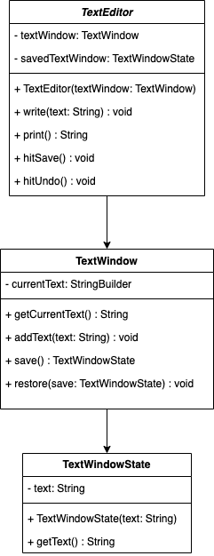
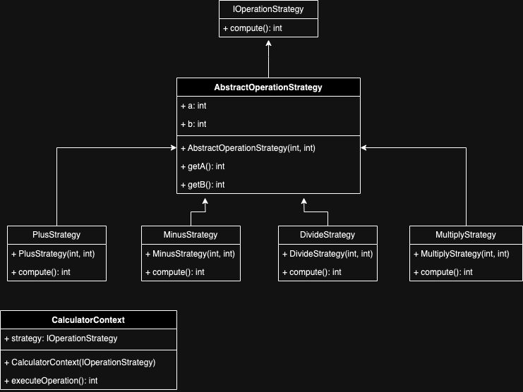
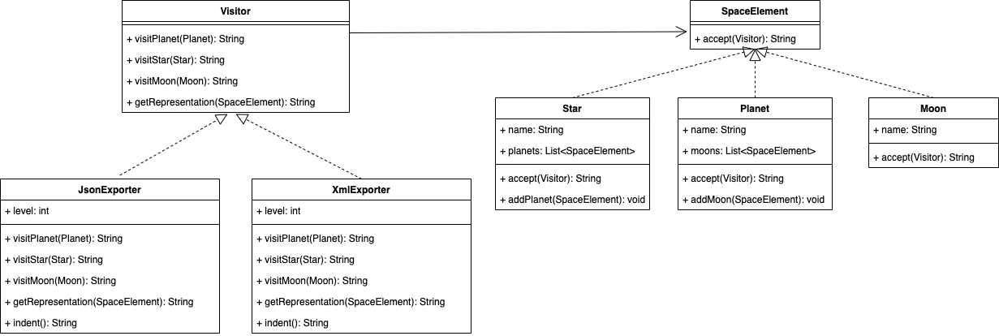

# Behavioral
## [Chain of responsability](chainResponsability)

## [Command](command)
- When you need parameterize objects according to an action perform.
- When you need to create and execute requests at different times.
- When you need to support rollback, logging or transaction functionality.

## [Mediator](mediator)
Mediator pattern is used to reduce communication complexity between multiple objects or classes. This pattern provides a mediator class which normally handles all the communications between different classes and supports easy maintenance of the code by loose coupling. Mediator pattern falls under behavioral pattern category.

## [Memento](memento)
Typically, the Memento Design Pattern will be used in situations where some actions are undoable, therefore requiring to rollback to a previous state. However, if the state of the Originator is heavy, using the Memento Design Pattern can lead to an expensive creation process and increased use of memory.

## [Observer](observer)
Lets you define a subscription mechanism to notify multiple objects about any events that happen to the object they’re observing.

## [Strategy](strategy)
When you want the algorithm to vary independently from clients that use it.

## [Visitor](visitor)
