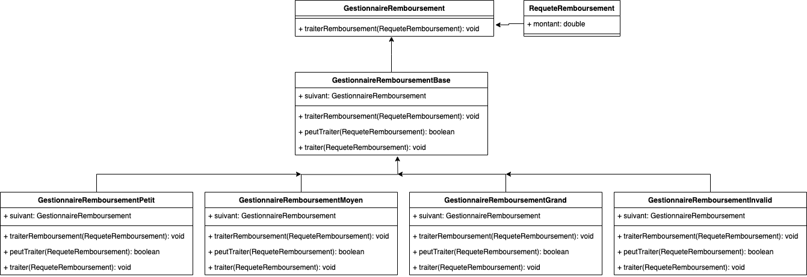
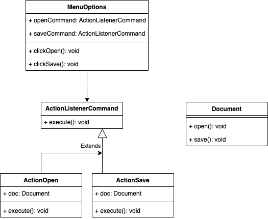
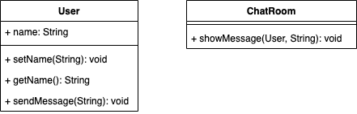
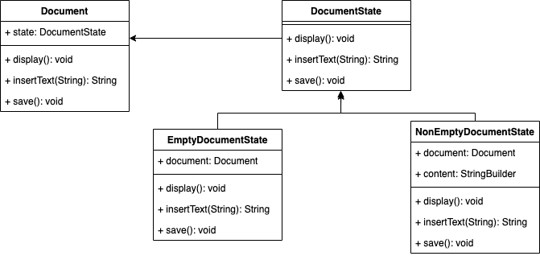

# Behavioral
Les Design Patterns comportementaux, en programmation, représentent des solutions éprouvées aux problèmes récurrents liés à la communication entre les objets et les responsabilités de ces objets. Ces design patterns se concentrent sur la manière dont les objets interagissent et communiquent entre eux.

Les designs patterns comportementaux les plus utilisés sont les suivants

## [Chain de résponsabilité](chainResponsability)
Le design pattern Chaîne de responsabilité est un modèle comportemental qui permet de traiter une requête à travers une série de gestionnaires, sans connaître à l'avance quel gestionnaire va la traiter. Chaque gestionnaire possède une référence vers le gestionnaire suivant dans la chaîne. Lorsqu'une requête est envoyée à la chaîne, chaque gestionnaire décide s'il peut la traiter ou s'il doit la transmettre au gestionnaire suivant.

**exemple d'implémentation :**

## [Commande](command)
Le design pattern Commande est une approche qui prend une action à réaliser et la convertit en un objet autonome qui encapsule tous les détails de cette action. Cette conversion permet de paramétrer des méthodes avec différentes actions, de planifier leur exécution, de les mettre en file d'attente ou d'annuler des opérations déjà effectuées.

**exemple d'implémentation :**

## [Interpréteur](interpretor)
Le design pattern Interpréteur est un modèle comportemental qui permet d'interpréter ou d'évaluer un langage ou une grammaire. Il définit une représentation grammaticale d'une langue donnée, ainsi qu'un interpréteur qui utilise cette représentation pour interpréter les phrases de cette langue. Chaque élément de la grammaire est représenté par une classe, et les combinaisons d'éléments sont interprétées par des méthodes spécifiques de ces classes. Lorsqu'une expression est passée à l'interpréteur, il utilise la représentation grammaticale pour interpréter et évaluer l'expression selon les règles définies par la grammaire.

**exemple d'implémentation :**

## [Médiateur](mediator)
Le pattern Médiateur est un design pattern comportemental qui favorise le couplage lâche en définissant un objet qui encapsule la manière dont un ensemble d'objets interagit. Plutôt que de permettre à ces objets de communiquer directement entre eux, ils communiquent uniquement à travers le médiateur. Cela réduit la dépendance entre les objets et facilite la modification et l'extension du système, car les interactions sont centralisées dans le médiateur.

**exemple d'implémentation :**

## [Memento](memento)
Le pattern Memento, un modèle de conception comportementale, offre la possibilité de sauvegarder et de rétablir l'état interne d'un objet sans compromettre son encapsulation. En Java, ce pattern est fréquemment employé pour mettre en place des fonctionnalités de sauvegarde et de restauration d'état dans les applications.

**exemple d'implémentation :**

## [Observateur](observer)
Le design Pattern Observateur fait partie de la famille des design patterns comportementaux. Il définît une relation observateurs / observé où l’observé informe de tout changement ses observateurs via l’une de leurs méthodes.
**exemple d'implémentation :**

## [Etat](state)
Le design pattern État est un design pattern comportemental qui permet à un objet de modifier son comportement en fonction de son état interne. Plutôt que de gérer directement les transitions entre les différents états, l'objet délègue cette responsabilité à des objets État spécialisés. Chaque objet État encapsule le comportement spécifique à un état particulier, ce qui permet à l'objet principal de déléguer dynamiquement ses actions en fonction de son état actuel.

**exemple d'implémentation :**

## [Strategy](strategy)
En programmation orientée objet, le design pattern Stratégie définit une famille d'algorithmes, encapsulant chacun d'eux, et les rendant interchangeables. Il permet à un client de choisir un algorithme parmi plusieurs sans modifier la structure du code. Cela favorise la flexibilité et l'extensibilité du code.

**exemple d'implémentation :**

## [Visitor](visitor)
Le design patterns Visiteur est un design pattern comportemental qui permet de séparer l'algorithme des éléments sur lesquels il opère. Il est souvent utilisé lorsque vous avez une structure d'objets complexe et que vous voulez ajouter de nouvelles opérations sans modifier les classes des objets eux-mêmes.

**exemple d'implémentation :**

