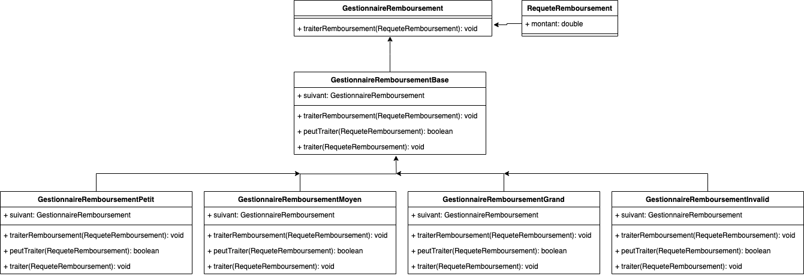

# Chaîne de responsabilité
## Definition
Le design pattern Chaîne de responsabilité est un modèle comportemental qui permet de traiter une requête à travers une série de gestionnaires, sans connaître à l'avance quel gestionnaire va la traiter. Chaque gestionnaire possède une référence vers le gestionnaire suivant dans la chaîne. Lorsqu'une requête est envoyée à la chaîne, chaque gestionnaire décide s'il peut la traiter ou s'il doit la transmettre au gestionnaire suivant.

## ⚖️ Avantanges et inconvénients
### ➕Avantages
- **Découplage** : La chaîne de responsabilité favorise le découplage entre l'émetteur de la requête et ses destinataires. L'émetteur ne sait pas à l'avance quel gestionnaire va traiter la requête, ce qui rend le système plus flexible et modulaire.
- **Flexibilité** : Il est facile d'ajouter, de supprimer ou de réorganiser les gestionnaires dans la chaîne sans modifier le code de l'émetteur ou des autres gestionnaires. Cela permet d'adapter facilement le système aux nouvelles exigences ou aux changements dans la logique de traitement des requêtes.
- **Traitement conditionnel** : Chaque gestionnaire peut prendre des décisions de manière conditionnelle sur la façon de traiter la requête, en fonction de critères tels que le type de requête, ses données ou l'état du système.
- **Gestion des erreurs** : Il est possible de fournir une gestion des erreurs plus sophistiquée. Il faut ajouter un gestionnaire spécial pour traiter les cas où aucune des responsabilités n'est capable de traiter la requête.
### ➖Inconvénients
- **Complexité accrue** : La mise en œuvre de la chaîne de responsabilité peut rendre le code plus complexe, en particulier si la logique de traitement des requêtes est dispersée entre plusieurs gestionnaires.
- **Debug plus compliqué** : La présence de plusieurs gestionnaires pour gérer différents cas peut rendre le debug plus difficile. En effet, il peut être nécessaire de suivre le chemin emprunté par la requête à travers la chaîne pour identifier la source d'une erreur.
- **Performance** : Si la chaîne de responsabilité est trop longue ou si les gestionnaires effectuent des opérations coûteuses, cela peut affecter les performances du système.

## Implementation
