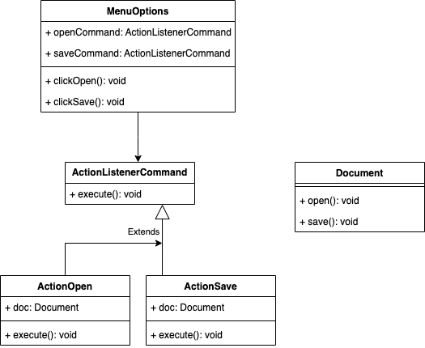

# Commande
## Definition
Le design pattern Commande est une approche qui prend une action à réaliser et la convertit en un objet autonome qui encapsule tous les détails de cette action. Cette conversion permet de paramétrer des méthodes avec différentes actions, de planifier leur exécution, de les mettre en file d'attente ou d'annuler des opérations déjà effectuées.

## ⚖️ Avantanges et inconvénients
### ➕Avantages
- **Séparation des Responsabilités** : Sépare l'objet qui invoque une opération de l'objet qui connaît comment exécuter cette opération.
- **Paramétrage des Objets** : Permet de paramétrer des objets avec des commandes spécifiques sans connaître les détails de l'implémentation.
- **Facilité d'Extension** : Ajouter de nouvelles commandes est facile sans modifier les classes existantes, ce qui suit le principe ouvert/fermé (Open/Closed Principle).
- **Réutilisabilité** :Les objets commande peuvent être réutilisés dans différents contextes, augmentant la réutilisabilité du code.
### ➖Inconvénients
- **Complexité Additionnelle** :Introduit de la complexité supplémentaire et du code boilerplate, car chaque opération nécessite une nouvelle classe de commande.
- **Maintenance Accrue** : Peut rendre le code plus verbeux et difficile à maintenir, surtout si le nombre de commandes devient important.
- **Performance** :Chaque commande est un objet, ce qui peut augmenter l'utilisation de la mémoire si de nombreuses commandes sont utilisées.
- **Débogage Complexe** : Traquer le flux d'exécution à travers les commandes peut être difficile, rendant le débogage plus complexe.

## Implementation
