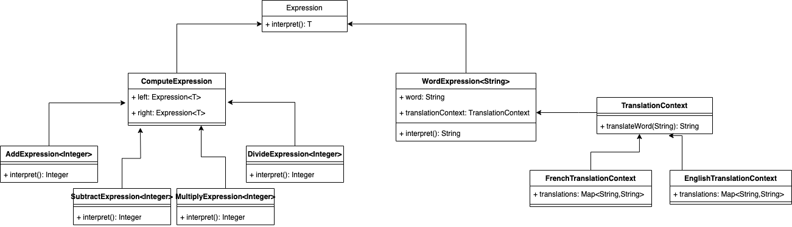

# Interpreteur
## Definition
Le design pattern Interpréteur est un modèle comportemental qui permet d'interpréter ou d'évaluer un langage ou une grammaire. Il définit une représentation grammaticale d'une langue donnée, ainsi qu'un interpréteur qui utilise cette représentation pour interpréter les phrases de cette langue.

Chaque élément de la grammaire est représenté par une classe, et les combinaisons d'éléments sont interprétées par des méthodes spécifiques de ces classes. Lorsqu'une expression est passée à l'interpréteur, il utilise la représentation grammaticale pour interpréter et évaluer l'expression selon les règles définies par la grammaire.
## ⚖️ Avantanges et inconvénients
### ➕Avantages
- **Structure modulaire** : Il permet de décomposer une grammaire complexe en une structure modulaire d'expressions simples, ce qui facilite la maintenance et l'évolution du système.
- **Facilité d'ajout de nouvelles fonctionnalités** : En ajoutant de nouvelles classes d'expressions ou en modifiant les règles de grammaire, on peut étendre facilement les fonctionnalités de l'interpréteur sans modifier son noyau.
- **Flexibilité** : L'interpréteur permet d'ajuster dynamiquement les règles de grammaire et les comportements d'interprétation, ce qui le rend flexible pour traiter différents types d'expressions et de langages.
### ➖Inconvénients
- **Complexité de la conception** : La mise en œuvre de l'interpréteur peut devenir complexe, surtout pour les langages ou les grammaires très complexes. La gestion des interactions entre les différentes classes d'expressions peut être délicate.
- **Performance** : Dans certains cas, l'interpréteur peut avoir des performances moins efficaces par rapport à d'autres méthodes de traitement des langages, comme la compilation. L'évaluation répétée des expressions peut entraîner des surcoûts de performance, notamment pour les expressions complexes.
- **Difficulté de compréhension** : Pour les développeurs non familiers avec le design pattern Interpréteur, sa logique peut être difficile à comprendre et à maintenir. La structure en arbre des expressions et les interactions entre les différentes classes peuvent rendre le code moins intuitif.
## Implementation
