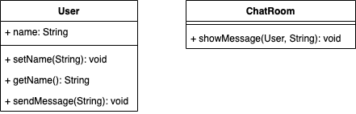

# Mediateur
## Definition
Le pattern Médiateur est un design pattern comportemental qui favorise le couplage lâche en définissant un objet qui encapsule la manière dont un ensemble d'objets interagit. Plutôt que de permettre à ces objets de communiquer directement entre eux, ils communiquent uniquement à travers le médiateur. Cela réduit la dépendance entre les objets et facilite la modification et l'extension du système, car les interactions sont centralisées dans le médiateur.

## ⚖️ Avantanges et inconvénients
### ➕Avantages
- **Découplage des composants** : Le principal avantage du pattern Médiateur est qu'il favorise un couplage lâche entre les objets en les obligeant à communiquer uniquement via le médiateur. Cela réduit la dépendance entre les composants du système, ce qui rend le code plus modulaire et plus facile à maintenir.
- **Centralisation des interactions** : En centralisant toutes les interactions entre les objets dans le médiateur, le pattern Médiateur rend le code plus organisé et plus facile à comprendre. Les interactions entre les objets sont clairement définies et encapsulées dans le médiateur, ce qui facilite la gestion des flux de données et des comportements du système.
- **Facilité d'extension** : Grâce à son architecture modulaire et décentralisée, le pattern Médiateur rend le système plus facile à étendre. Il est relativement simple d'ajouter de nouveaux objets ou de modifier le comportement des objets existants en modifiant le médiateur, sans avoir à modifier directement les autres composants du système.
### ➖Inconvénients
- **Complexité accrue du médiateur** : Si le médiateur devient trop complexe ou s'il est mal conçu, il peut devenir un point de singularité dans le système, ce qui rendrait le code difficile à maintenir. Il est important de concevoir le médiateur de manière à ce qu'il reste simple et facile à comprendre, même lorsque le système se développe.
- **Augmentation de la dépendance sur le médiateur** : Comme tous les objets communiquent à travers le médiateur, cela peut entraîner une dépendance accrue sur ce composant. Si le médiateur échoue ou devient indisponible, cela peut affecter la capacité du système à fonctionner correctement.
- **Surutilisation du pattern** : Il est important de ne pas abuser du pattern Médiateur. Utiliser un médiateur pour chaque interaction entre les objets peut rendre le code difficile à suivre et à comprendre. Il est préférable de réserver l'utilisation du pattern Mediator pour les cas où il offre un réel avantage en termes de modularité et de maintenabilité.
- **Coût d'initialisation** : La mise en place d'un médiateur peut ajouter un coût d'initialisation au système, surtout si celui-ci doit gérer de nombreux objets et interactions. Il est important de considérer ce coût lors de la conception du système et de s'assurer que le bénéfice en termes de modularité et de maintenabilité justifie ce coût supplémentaire.

## Implementation
