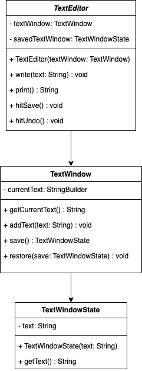

# Factory
## Definition
Le pattern Memento, un modèle de conception comportementale, offre la possibilité de sauvegarder et de rétablir l'état interne d'un objet sans compromettre son encapsulation. En Java, ce pattern est fréquemment employé pour mettre en place des fonctionnalités de sauvegarde et de restauration d'état dans les applications.

## ⚖️ Avantanges et inconvénients
### ➕Avantages
- **Restauration d'état précis** : Le pattern Memento permet de restaurer un objet à un état précis précédemment enregistré, ce qui est utile pour annuler des actions ou revenir à un état antérieur.
- **Encapsulation préservée** : L'objet Originator n'a pas besoin de révéler ses détails d'implémentation pour sauvegarder ou restaurer son état, préservant ainsi son encapsulation.
- **Facilité d'extension** : Comme le Memento encapsule l'état, il est relativement simple d'ajouter de nouveaux attributs à l'état de l'objet Originator sans modifier son interface.
- **Flexibilité** : Le pattern Memento permet de conserver plusieurs états passés dans l'historique, offrant ainsi une flexibilité pour restaurer n'importe quel état antérieur.
### ➖Inconvénients
- **Consommation de mémoire** : Conserver chaque état précédent dans l'historique peut consommer de la mémoire, surtout si les objets Memento sont volumineux.
- **Complexité accrue** : Si l'objet Originator possède un grand nombre d'attributs ou un état complexe, la gestion des Mementos et de l'historique peut devenir difficile.
- **Performance** : La sauvegarde et la restauration d'état peuvent avoir un coût en termes de performance, surtout si l'état est volumineux ou si l'historique est long.
- **Usage approprié** : Le pattern Memento est plus adapté aux scénarios où la gestion de l'historique est nécessaire, ce qui peut ne pas être le cas pour tous les types d'objets.

## Implementation
