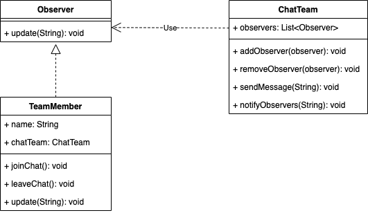

# Observateur
## Definition
Le design Pattern Observateur fait partie de la famille des design patterns comportementaux.

Il définît une relation observateurs / observé où l’observé informe de tout changement ses observateurs via l’une de leurs méthodes.
## ⚖️ Avantanges et inconvénients
### ➕Avantages
- **Découplage fort** : Le pattern Observateur permet de séparer le sujet et les observateurs, réduisant ainsi le couplage entre les composants.
- **Extensibilité** : Il est facile d'ajouter de nouveaux observateurs sans modifier le sujet.
- **Modularité** : Les observateurs peuvent être réutilisés dans différents contextes sans modification.
### ➖Inconvénients
- **Mise à jour inefficace** : Si le sujet a de nombreux observateurs et que les mises à jour sont fréquentes, cela peut entraîner des performances inefficaces.
- **Risque de fuites de mémoire** : Si les observateurs ne sont pas correctement gérés, cela peut entraîner des fuites de mémoire.
## Implementation
