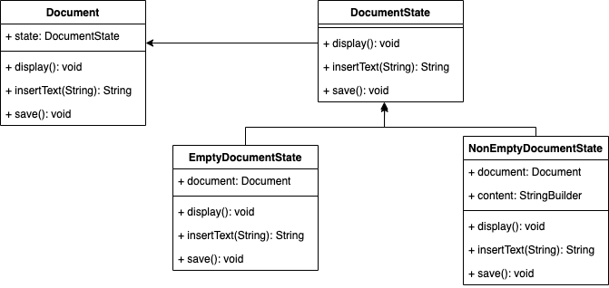

# État
## Definition
Le design pattern État est un design pattern comportemental qui permet à un objet de modifier son comportement en fonction de son état interne.

Plutôt que de gérer directement les transitions entre les différents états, l'objet délègue cette responsabilité à des objets État spécialisés.

Chaque objet État encapsule le comportement spécifique à un état particulier, ce qui permet à l'objet principal de déléguer dynamiquement ses actions en fonction de son état actuel.

## ⚖️ Avantanges et inconvénients
### ➕Avantages
- **Modularité et extensibilité** : Le pattern État permet d'encapsuler chaque état dans une classe distincte, favorisant ainsi la modularité du code. Cela rend également l'ajout de nouveaux états ou la modification des comportements existants plus facile et moins risqué.
- **Séparation des préoccupations** : Ce pattern permet de séparer les différents comportements en fonction des états, ce qui rend le code plus facile à comprendre et à maintenir. Chaque classe État est responsable de son propre comportement, ce qui réduit le couplage entre les différentes parties du système.
- **Flexibilité** : Le pattern État permet aux objets de modifier dynamiquement leur comportement en fonction de leur état interne. Cela offre une grande flexibilité dans la gestion des transitions entre les états et permet d'adapter le comportement de l'objet en fonction du contexte.
### ➖Inconvénients
- **Complexité accrue** : L'usage du pattern État peut rendre le code plus complexe, en particulier dans les systèmes avec de nombreux états et transitions. La multiplication des classes État peut rendre le code plus difficile à comprendre pour les développeurs, en particulier s'ils ne sont pas familiers avec le pattern.
- **Surcoût initial** : La mise en place du pattern État peut nécessiter un surcoût initial en termes de conception et de développement. Il faut créer des classes État pour chaque état possible, ce qui peut prendre du temps et de l'effort.
- **La cohérence** : Si les transitions entre les états ne sont pas correctement gérées, cela peut conduire à des problèmes de cohérence dans le système. Il est important de s'assurer que les transitions entre les états sont correctement gérées pour éviter les comportements imprévus.
## Implementation
