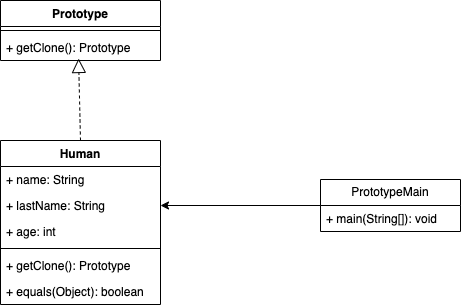

# Creation
Les Design Patterns de Création sont un ensemble de design patterns qui permettent de créer des objets d'une manière qui soit flexible, modulaire et qui facilite leur réutilisation. Ils sont utilisés pour résoudre des problèmes de conception liés à la création d'objets.

Les designs pattern de création les plus utilisés sont les suivants

## [Factory](factory)

En programmation orientée objet, le design pattern factory est un pattern de création qui utilise des méthodes de fabrication pour résoudre le problème de création d'objets sans avoir à spécifier la classe exacte de l'objet à créer. On utilise une interface ou une classe abstraite pour définir une méthode de création qui est implémentée par les sous-classes pour créer des objets de différentes classes. Ainsi, le Factory Method permet de créer des objets sans connaitre leur implémentation.

### exemple d'implémentation :

## [Builder](builder)

Le design pattern Builder est un modèle de conception qui permet de créer des objets complexes en séparant leur construction de leur représentation. En programmation orientée objet, ce design pattern est couramment utilisé pour créer des objets avec de nombreuses propriétés, en évitant de définir chacune de ces propriétés à chaque fois qu'un nouvel objet est créé.

### exemple d'implémentation :

## [Prototype](prototype)

En programmation orientée objet, le design pattern Prototype est utilisé lorsque la création d'une instance est complexe ou consommatrice en temps. Plutôt que créer plusieurs instances de la classe, on copie la première instance et on modifie la copie de façon appropriée.

### exemple d'implémentation :

## [Singleton](singleton)

En programmation orientée objet, le design pattern Singleton est utilisé pour s'assurer qu'une classe ne possède qu'une seule instance et pour fournir un point d'accès à cette unique instance.

### exemple d'implémentation :

