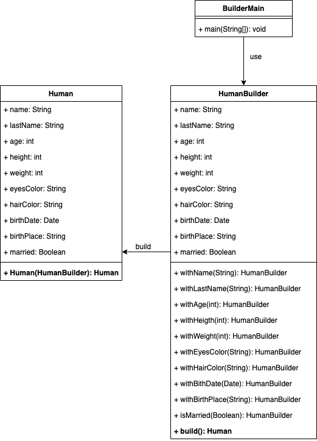

# Builder
## Definition
`The builder pattern is a design pattern that allows for the step-by-step creation of complex objects using the correct sequence of actions. The construction is controlled by a director object that only needs to know the type of object it is to create.`

## Where to use
When you have a simple object, this pattern is not very useful, but when you begin to have a more complex object and want to have a clear code you can use it without hesitation

## Implementation
