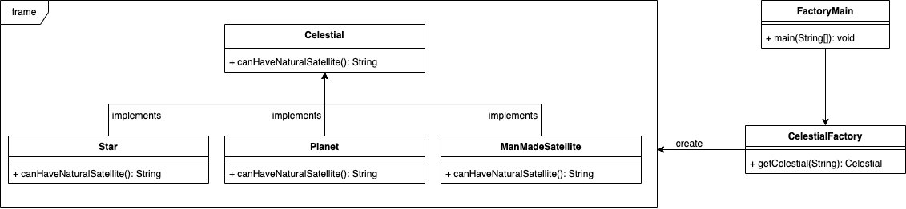

# Factory
## Definition
En programmation orientée objet, le design pattern factory est un pattern de création qui utilise des méthodes de fabrication pour résoudre le problème de création d'objets sans avoir à spécifier la classe exacte de l'objet à créer. On utilise une interface ou une classe abstraite pour définir une méthode de création qui est implémentée par les sous-classes pour créer des objets de différentes classes. Ainsi, le Factory Method permet de créer des objets sans connaitre leur implémentation.

## ⚖️ Avantanges et inconvénients
### ➕Avantages
- **Encapsulation de la Création** :
    - Masquer la Logique de Création: Le pattern Factory encapsule la logique de création d'objets, ce qui permet de masquer les détails complexes de création et de simplifier le code client.
    - Centralisation de la Création: Toute la logique de création est centralisée dans un endroit, ce qui facilite la maintenance et les modifications futures.
- **Réduction du Couplage** :
    - Diminution de la Dépendance: Les classes utilisant des produits fabriqués n'ont pas besoin de connaître les classes concrètes des produits, réduisant ainsi les dépendances entre les composants.
- **Facilité de Maintenance et d'Évolution** :
    - Extension Facile: Il est facile d'ajouter de nouvelles variantes de produits sans modifier le code existant, simplement en créant de nouvelles sous-classes ou en modifiant la factory.
    - Conformité au Principe Ouvert/Fermé: Le pattern Factory suit le principe ouvert/fermé (Open/Closed Principle), permettant l'extension du code sans modification des classes existantes.
- **Gestion de la Complexité** :
    - Simplicité de l'Interface: Le client interagit avec une interface ou une classe abstraite, simplifiant ainsi l'interaction avec des objets complexes ou variés.
### ➖Inconvénients
- **Complexité Additionnelle** :
    - Surcharge de Code: La mise en œuvre du pattern Factory peut ajouter de la complexité et du code supplémentaire, notamment en raison de la création de classes factory et de l'interface commune.
    - Classes Multiples: Peut nécessiter la création de nombreuses sous-classes, ce qui peut rendre le projet plus verbeux et plus complexe à naviguer.
- **Moins de Flexibilité Initiale** :
    - Contrainte des Produits: Le pattern impose une structure qui peut être contraignante dans certains cas où une flexibilité totale dans la création des objets serait souhaitable.
- **Difficulté de Debugging** :
    - Traçabilité: La logique de création étant centralisée dans une factory, il peut être plus difficile de tracer l'origine des objets créés lors du débogage.

## Implementation
