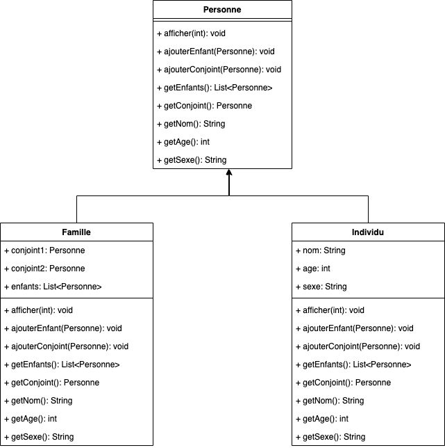

# Structurel
Les Design Patterns de Création sont un ensemble de design patterns qui permettent de créer des objets d'une manière qui soit flexible, modulaire et qui facilite leur réutilisation. Ils sont utilisés pour résoudre des problèmes de conception liés à la création d'objets.

Les designs pattern de création les plus utilisés sont les suivants

## [Adaptateur](adaptateur)

Le design pattern Adaptateur est un modèle structurel qui permet à des interfaces incompatibles de collaborer entre elles. Il agit comme un intermédiaire qui convertit l'interface d'une classe en une autre interface attendue par le client.

Ce design pattern définit un adaptateur qui enveloppe l'objet à adapter, fournissant ainsi une interface conforme aux attentes du client. De cette manière, le client peut utiliser l'adaptateur comme s'il s'agissait de l'interface originale, sans connaître les détails de l'implémentation sous-jacente.

Chaque adaptateur implémente l'interface attendue par le client et utilise l'objet à adapter pour répondre aux appels de méthode. Cela permet d'intégrer des composants existants dans de nouvelles architectures sans avoir à les modifier, favorisant ainsi la réutilisation du code et la compatibilité entre différentes parties d'un système logiciel.

### exemple d'implémentation :

## [Pont](bridge)

Le design pattern Pont permet de découpler une abstraction d'une implémentation afin qu'elles puissent évoluer indépendamment.

Il permet de séparer la logique d'une classe de sa représentation physique, facilitant ainsi la gestion et l'extension du code.

Le pattern Pont utilise la composition plutôt que l'héritage, permettant de combiner des implémentations et des abstractions de manière plus flexible.

### exemple d'implémentation :

## [Composite](composite)

Le design pattern Composite permet de composer des objets en structures arborescentes pour représenter des hiérarchies.

Imaginez un arbre : l'arbre complet représente l'ensemble de la structure, les branches représentent les compositions d'objets (les composites), et les feuilles représentent les objets individuels (les feuilles). De la même manière qu'un arbre peut être constitué de branches et de feuilles, une structure composite permet de combiner des objets simples et des compositions d'objets pour former une hiérarchie complexe.

### exemple d'implémentation :

## [Décorateur](decorator)

Le design pattern **Décorateur**, aussi connu sous le nom de **Wrapper**, permet d’ajouter dynamiquement des comportements ou des responsabilités à un objet sans modifier son code.

Il favorise l'utilisation de la composition plutôt que de l'héritage pour l'extension des fonctionnalités.

Le décorateur enveloppe l'objet d'origine et ajoute de nouvelles fonctionnalités tout en déléguant les appels à l'objet encapsulé.

### exemple d'implémentation :

## [Façade](facade)

Le design pattern Façade fournit une interface simplifiée à un ensemble de classes ou à un sous-système complexe.

Il agit comme une "façade" qui cache la complexité des interactions internes, offrant aux clients une interface plus simple et plus facile à utiliser.

Ce pattern est particulièrement utile lorsque vous avez un système complexe avec de nombreuses classes interconnectées, et que vous souhaitez fournir une interface plus intuitive pour les utilisateurs de ce système.

### exemple d'implémentation :

## [Proxy](proxy)

### exemple d'implémentation :