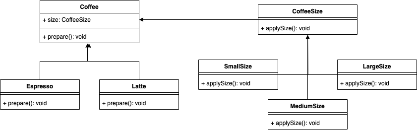

# Pont
## Definition
Le design pattern Pont permet de découpler une abstraction d'une implémentation afin qu'elles puissent évoluer indépendamment.

Il permet de séparer la logique d'une classe de sa représentation physique, facilitant ainsi la gestion et l'extension du code.

Le pattern Pont utilise la composition plutôt que l'héritage, permettant de combiner des implémentations et des abstractions de manière plus flexible.
## ⚖️ Avantanges et inconvénients
### ➕Avantages
- **Séparation des préoccupations** : En séparant l'abstraction de son implémentation, il devient plus facile de gérer et de maintenir le code. Cela améliore la clarté et la lisibilité du code.
- **Flexibilité** : Les abstractions et les implémentations peuvent évoluer indépendamment. On peut changer une implémentation sans affecter l'abstraction et vice versa.
- **Réduction de la complexité** : Le pattern réduit le nombre de sous-classes nécessaires. Au lieu de créer plusieurs classes pour chaque combinaison d'abstraction et d'implémentation, on crée des classes indépendantes qui peuvent être combinées dynamiquement.
- **Composition** : Plutôt que d'utiliser un héritage rigide, le pattern favorise la composition, permettant une plus grande modularité et réutilisabilité du code.
### ➖Inconvénients
- **Complexité accrue** : L'introduction de couches supplémentaires peut rendre le code plus complexe à comprendre pour les développeurs qui ne sont pas familiers avec le pattern.
- **Maintenance** : La séparation stricte entre l'abstraction et l'implémentation peut parfois mener à une surcharge de maintenance, surtout si le modèle est mal appliqué ou dans des cas où il n'est pas nécessaire.
## Implementation
