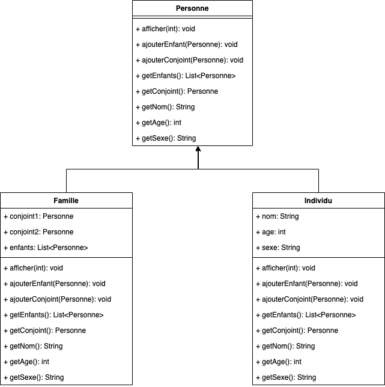

# Composite
## Definition
Le design pattern Composite permet de composer des objets en structures arborescentes pour représenter des hiérarchies.

Imaginez un arbre : l'arbre complet représente l'ensemble de la structure, les branches représentent les compositions d'objets (les composites), et les feuilles représentent les objets individuels (les feuilles). De la même manière qu'un arbre peut être constitué de branches et de feuilles, une structure composite permet de combiner des objets simples et des compositions d'objets pour former une hiérarchie complexe.
## ⚖️ Avantanges et inconvénients
### ➕Avantages
- **Manipulation des hiérarchies complexes** : Le pattern Composite permet de traiter les objets simples (les feuilles) et les compositions d'objets (les branches) de manière uniforme. Cela simplifie le code client qui n'a pas besoin de connaître la différence entre un objet simple et une composition d'objets.
- **Ajout de nouvelles composantes** : Le pattern permet d'ajouter facilement de nouvelles composantes (feuilles ou composites) sans modifier le code existant.
- **Flexibilité et extensibilité** : La structure arborescente permet de représenter facilement des hiérarchies complexes et de les étendre au besoin.
### ➖Inconvénients
- **Gestion de la complexité** : Bien que le pattern Composite simplifie la manipulation des hiérarchies complexes, il peut introduire une certaine complexité dans la gestion des objets, notamment en ce qui concerne les opérations spécifiques à certaines classes.
- **Difficulté de mise en œuvre** : Il peut être difficile de restreindre les types d'objets qui peuvent être ajoutés à une composition, ce qui peut entraîner des erreurs si des objets inappropriés sont ajoutés.

## Implementation
