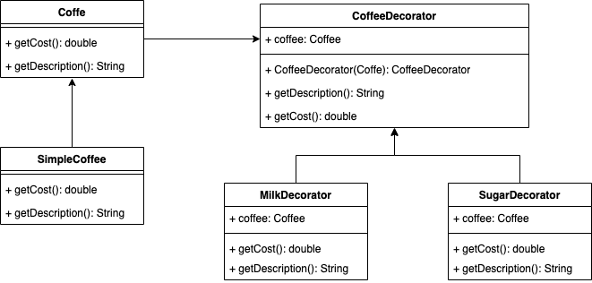

# Décorateur
## Definition
Le design pattern **Décorateur**, aussi connu sous le nom de **Wrapper**, permet d’ajouter dynamiquement des comportements ou des responsabilités à un objet sans modifier son code.

Il favorise l'utilisation de la composition plutôt que de l'héritage pour l'extension des fonctionnalités.

Le décorateur enveloppe l'objet d'origine et ajoute de nouvelles fonctionnalités tout en déléguant les appels à l'objet encapsulé.

## ⚖️ Avantanges et inconvénients
### ➕Avantages
- **Flexibilité accrue** : Contrairement à l'héritage, le décorateur permet d'ajouter des fonctionnalités de manière dynamique et flexible à un objet.
- **Combinaison de comportements** : Les décorateurs peuvent être empilés les uns sur les autres, permettant ainsi de combiner différentes fonctionnalités de manière modulaire.
- **Responsabilité unique** : Chaque décorateur a une seule responsabilité, ce qui rend le code plus facile à maintenir et plus lisible.
- **Réutilisabilité** : Les composants peuvent être réutilisés indépendamment dans différents contextes sans avoir besoin de dupliquer le code.
### ➖Inconvénients
- **Complexité accrue** : L'utilisation de plusieurs décorateurs peut rendre la compréhension du code plus difficile, surtout si les décorateurs sont imbriqués.
- **Difficile à débug** : La multiplication des couches de décoration peut rendre le débogage et le suivi des appels plus complexes.
- **Performance** : Chaque appel de méthode passe par plusieurs objets, ce qui peut légèrement dégrader les performances.
## Implementation
