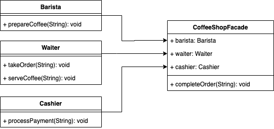

# Façade
## Definition
Le design pattern Façade fournit une interface simplifiée à un ensemble de classes ou à un sous-système complexe.

Il agit comme une "façade" qui cache la complexité des interactions internes, offrant aux clients une interface plus simple et plus facile à utiliser.

Ce pattern est particulièrement utile lorsque vous avez un système complexe avec de nombreuses classes interconnectées, et que vous souhaitez fournir une interface plus intuitive pour les utilisateurs de ce système.
## ⚖️ Avantanges et inconvénients
### ➕Avantages
- **Simplification de l'interface** : La façade offre une interface simplifiée et unifiée pour un ensemble de classes ou un sous-système, rendant le code plus facile à comprendre et à utiliser.
- **Réduction de la dépendance** : En utilisant une façade, les clients n'ont pas besoin de connaître les détails des classes internes du système. Cela réduit les dépendances entre les composants du système.
- **Encapsulation** : La façade masque la complexité du système et protège les composants internes des modifications, favorisant ainsi une meilleure encapsulation.
- **Facilité de maintenance** : Avec une interface simplifiée, il devient plus facile de modifier ou de mettre à jour le sous-système sans impacter les clients qui utilisent la façade.
### ➖Inconvénients
- **Couche supplémentaire** : L'utilisation d'une façade introduit une couche supplémentaire d'abstraction, ce qui peut parfois ajouter une légère surcharge en termes de performance et de complexité.
- **Masquage excessif** : Dans certains cas, la façade peut masquer trop de détails du sous-système, limitant ainsi la flexibilité et les possibilités d'optimisation pour les utilisateurs avancés.
## Implementation
